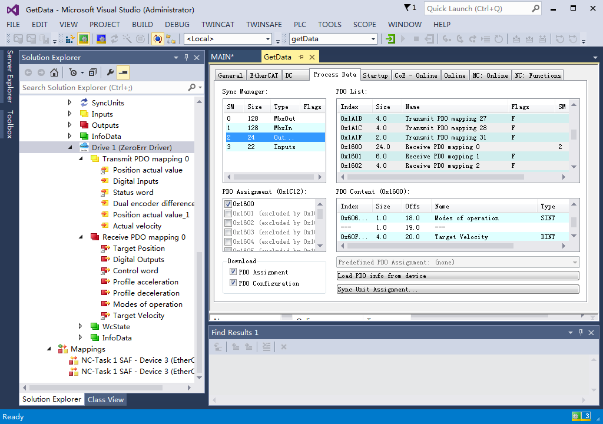

# 数据标定方法

# 说明

本工程需配合[Zerotorque](https://github.com/cantorxu/ZeroTorque)主程序使用，主要功能为辅助输出标定参数。

main/: 程序主体

# **1. 在TwinCAT中新建工程**

可参考[《eRob CANopen and EtherCAT用户手册v1.8.pdf》](https://www.zeroerr.cn./d/file/download/eRob%20CANopen%20and%20EtherCAT%E7%94%A8%E6%88%B7%E6%89%8B%E5%86%8Cv1.9.pdf)的第六章“TwinCAT主站控制”介绍的基于 Beckhoff TwinCAT3 主站对 ZeroErr EtherCAT 从站设备进行 PDO 配置以及运动控制的方法和步骤。

下面介绍一些关键步骤

## **PDO配置**

按照手册添加PDO参数，并将这些变量与程序(程序在后面给出)中定义的变量一一对应，注意：需要编译后才可以进行链接

| Name | Address | Align |
| --- | --- | --- |
| Transmit PDO | 0x1A00 | 链接变量 |
| Dual encoder difference value | 0x2241 | DualPosDiff |
| Position actual value | 0x6064 | actPosition |
| Actual velocity | 0x606C | actVelo |
| Receive PDO | 0x1600 | 链接变量 |
| Profile acceleration | 0x6083 | udiProAcc |
| Profile deceleration | 0x6084 | udiProDec |
| Modes of operation | 0x6060 | siOperationMode |
| Target Velocity | 0x60FF | targetVelo |

# 2. 程序编写

新建一个PLC文件，并在MAIN.TcPOU中写入程序

## 程序的主要逻辑

1. 设置机器人关节操作模式为3，即轮廓速度模式（PV mode）
2. 设置加减速度
3. 根据当前角度设置运行速度
4. 通过状态机实现关节正反运行

# 3. 示波器设置

在项目工程中添加一个Scope YT Project.tcscope的项目

在原始一个的Axis的基础上新建两个新的Axis，按照DualPosDiff，actVelo，actAngle的顺序依次填入三个Axis中

# 4. 关节运行

1. 将程序进行编译→Restart TwinCAT(Config Mode)→Activate Configuration
2. 在Receive PDO中手动将Control word从6使能(Force)为47，使能关节
3. Scope Record start(开启示波器)
4. 等待观察到关节完成一个完整的正反转周期性运动后可以停止程序
5. Stop record，将示波器数据导出为csv文件(记录路径)
6. 将Control word将47使能为6，将关节下使能

# 5. 数据后处理

打开Tools文件夹下的数据处理程序，使用说明见《数据标注程序使用说明》，下面简略描述

1. 修改文件夹中的`ReadData.yaml`中的`path`路径为上面导出的csv文件的路径
2. 双击运行`allRangeFitting.exe` ，等待十秒程序运行完成
3. 随后即可在output获得输出的拟合图片和配置参数
4. 记录参数，稍后添加到主运行程序中

